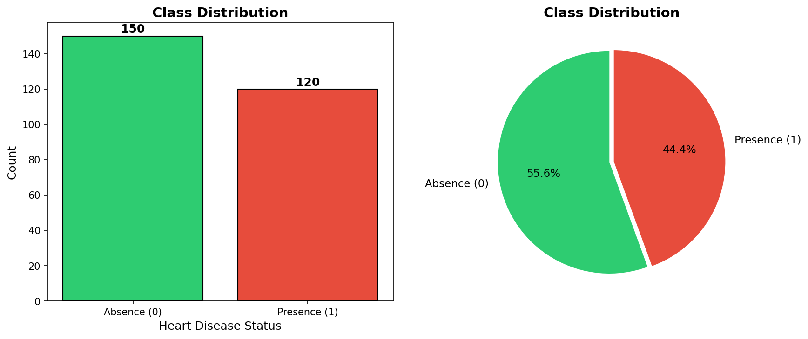
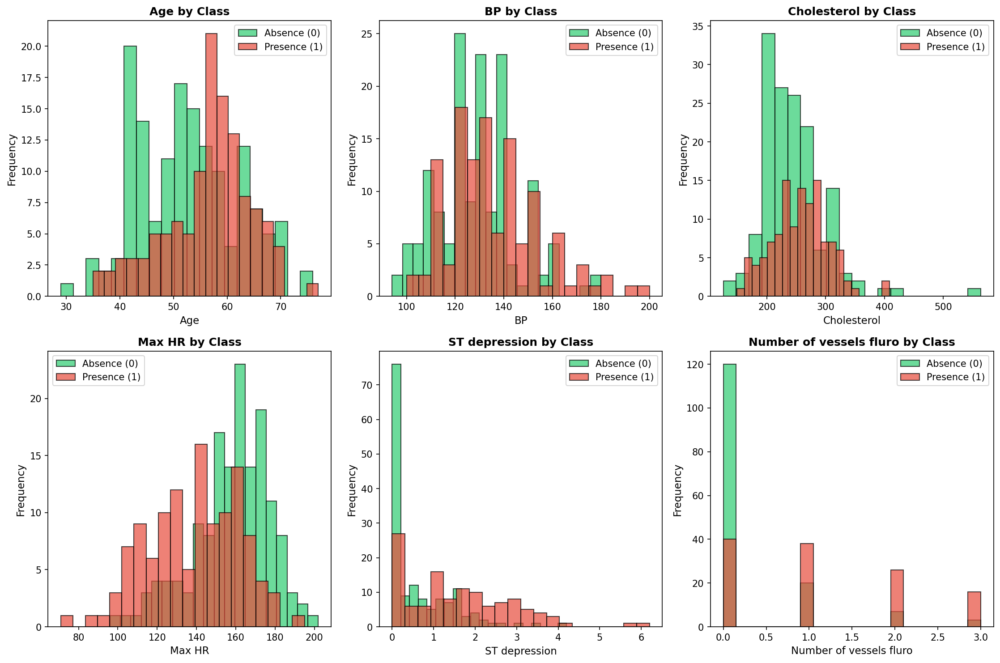
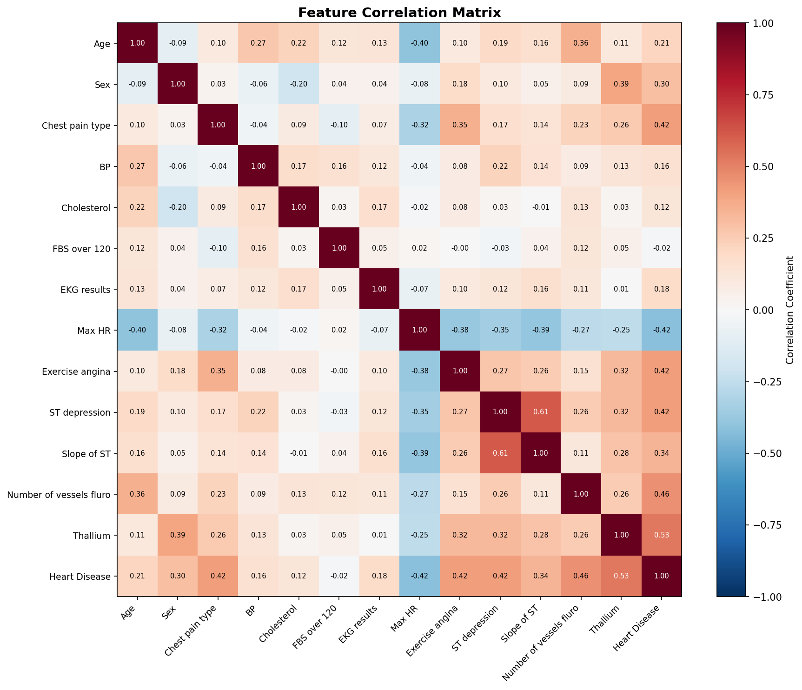
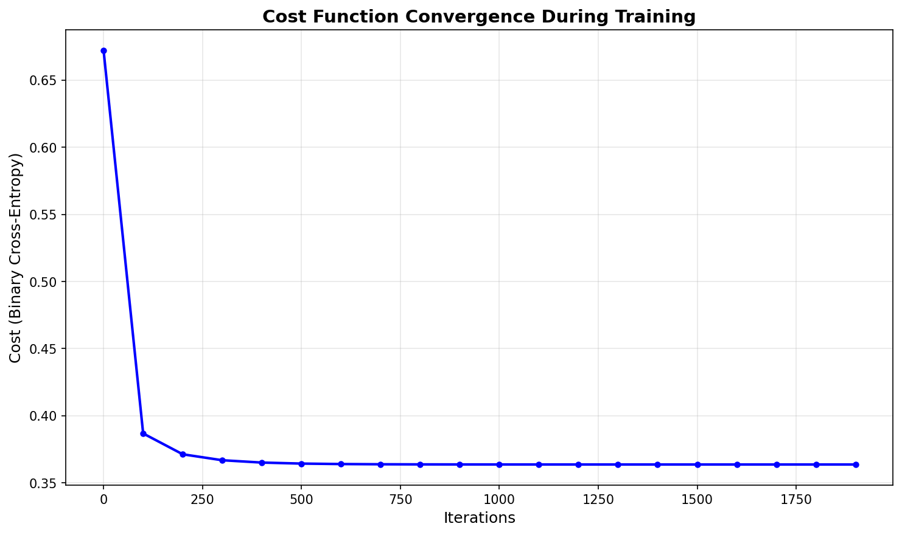
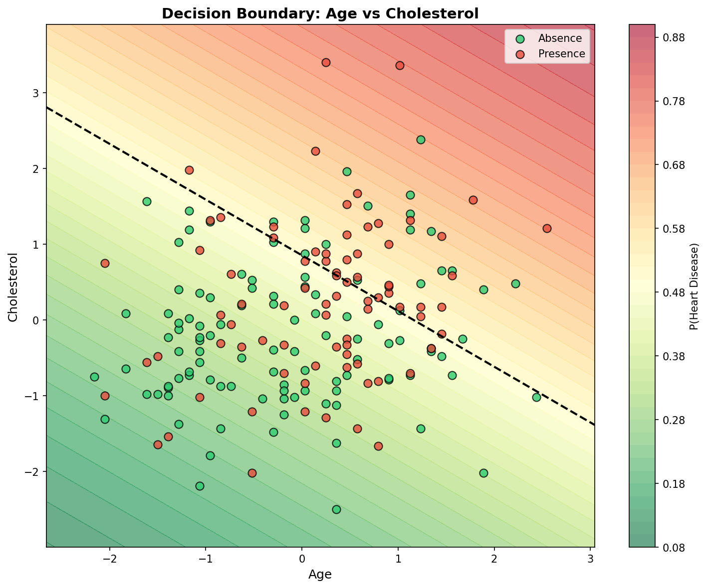
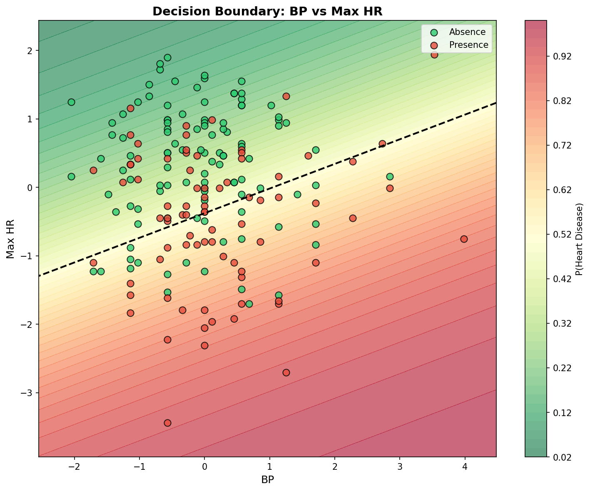
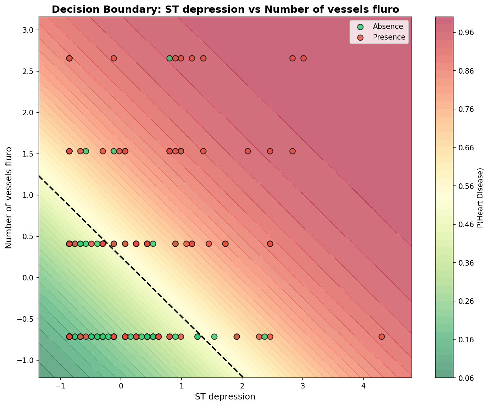
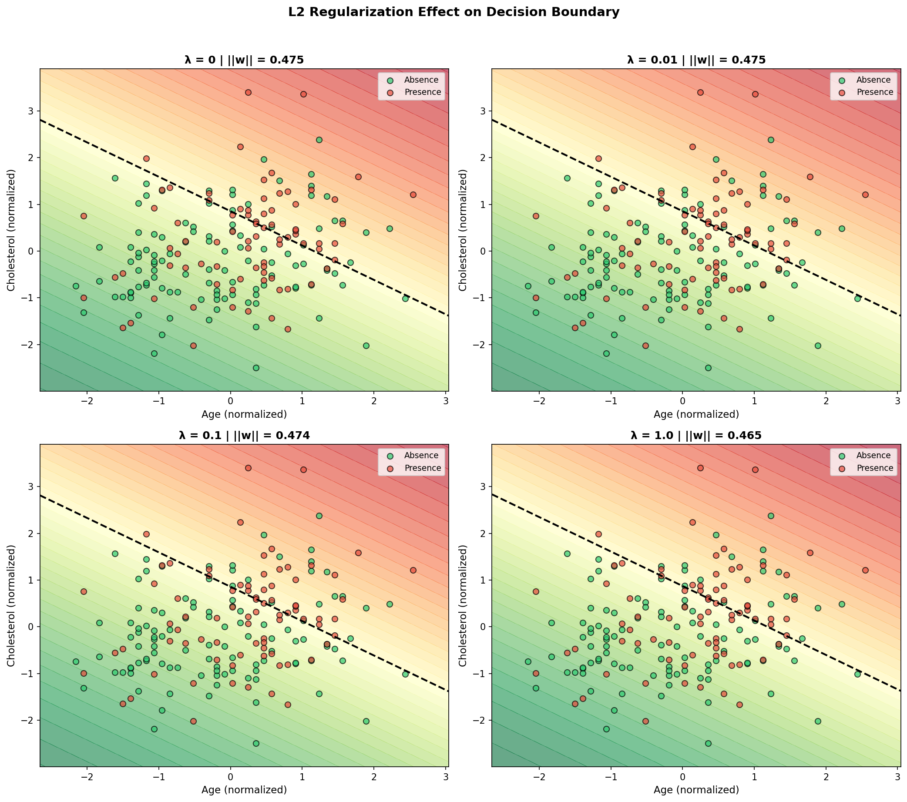
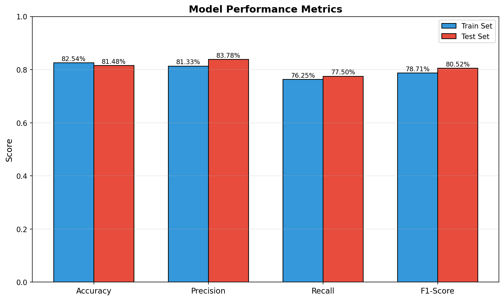
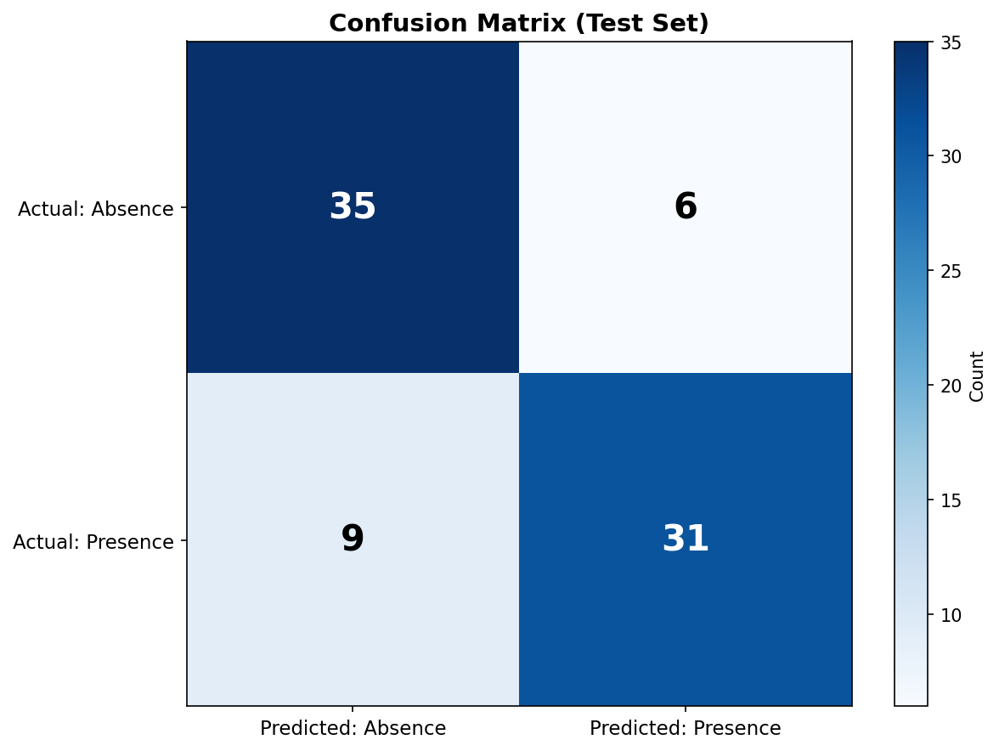

# Heart Disease Risk Prediction: Logistic Regression Homework

## Exercise Summary

Implements logistic regression for heart disease prediction: EDA, training/visualization, regularization, and SageMaker deployment. This project builds logistic regression from scratch using NumPy—no scikit-learn for core training—to understand the mathematical foundations behind classification algorithms.

## Getting Started

These instructions will give you a copy of the project up and running on your local machine for development and testing purposes. See deployment for notes on deploying the project on AWS SageMaker.

### Prerequisites

Requirements for running the notebooks:

- [Python 3.x](https://www.python.org/)
- [NumPy](https://numpy.org/) - Numerical computing
- [Pandas](https://pandas.pydata.org/) - Data manipulation and analysis
- [Matplotlib](https://matplotlib.org/) - Visualization
- [Jupyter Notebook](https://jupyter.org/) - For local execution
- [AWS Account](https://aws.amazon.com/) - For SageMaker execution

> **Not allowed:** scikit-learn, statsmodels, TensorFlow/PyTorch, or any high-level regression/optimization library for core training.

### Installing

A step by step series to get a development environment running:

1. Clone the repository

    ```bash
    git clone https://github.com/AnderssonProgramming/logistic-regression-aws-ai.git
    cd logistic-regression-aws-ai
    ```

2. Install the required libraries

    ```bash
    pip install numpy pandas matplotlib jupyter
    ```

3. Launch Jupyter Notebook

    ```bash
    jupyter notebook
    ```

4. Open and run the notebook:
   - `heart_disease_lr_analysis.ipynb`

## Introductory Context

Heart disease is the world's leading cause of death, claiming approximately 18 million lives each year, as reported by the World Health Organization. Predictive models like logistic regression can enable early identification of at-risk patients by analyzing clinical features such as age, cholesterol, and blood pressure. This not only improves treatment outcomes but also optimizes resource allocation in healthcare settings. In this homework, you'll implement logistic regression on the Heart Disease Dataset—a real-world UCI repository collection of 303 patient records with 14 features and a binary target (1 for disease presence, 0 for absence). You'll train models, visualize boundaries, apply regularization, and explore deployment via Amazon SageMaker to mimic a production pipeline.

### Motivation for Cloud Execution and Enterprise Context

This project is part of a four-week Machine Learning Bootcamp embedded in a course on Digital Transformation and Enterprise Architecture. In this context, machine learning is treated as a core architectural capability of modern enterprise systems.

Today, intelligence is increasingly considered a first-class quality attribute alongside scalability, availability, security, and performance. Intelligent behavior is no longer confined to offline analytics; it is embedded into platforms, decision-support services, and autonomous or semi-autonomous components.

As enterprise architects, it is not sufficient to understand what models do. We must also understand how they are built from first principles, executed and validated in controlled environments, and operated within cloud platforms.

## Dataset Description

### Source

**Kaggle Heart Disease Dataset** - Downloaded from [https://www.kaggle.com/datasets/neurocipher/heartdisease](https://www.kaggle.com/datasets/neurocipher/heartdisease)

> **About Kaggle:** Kaggle is a popular online platform for data science enthusiasts, hosting datasets, competitions, and notebooks—think of it as GitHub for data and ML projects (free to join at [kaggle.com](https://kaggle.com)).

### About the Dataset

This dataset contains real-world clinical attributes used to analyze and predict the presence or absence of heart disease. Each row represents one patient, and each column represents a medical measurement or diagnostic indicator.

**✨ Suitable for:**
- 📊 Exploratory Data Analysis (EDA)
- 🤖 Machine Learning / AI models
- 🧪 Binary classification
- 🔍 Feature importance analysis
- 🧠 Medical data science practice

### Dataset Overview

| Attribute | Description |
|-----------|-------------|
| **Samples** | 270 patient records |
| **Features** | 14 clinical attributes |
| **Target** | Binary (Presence = disease, Absence = no disease) |
| **Disease Rate** | ~44.4% presence rate (120 Presence / 150 Absence) |

### Column Descriptions (Data Dictionary)

| Column Name | Description | Values/Range |
|-------------|-------------|--------------|
| **Age** | Age of the patient | 29-77 years |
| **Sex** | Gender of the patient | 1 = Male, 0 = Female |
| **Chest pain type** | Type of chest pain | 1 = Typical angina, 2 = Atypical angina, 3 = Non-anginal pain, 4 = Asymptomatic |
| **BP** | Resting blood pressure | 94-200 mm Hg |
| **Cholesterol** | Serum cholesterol level | 126-564 mg/dL |
| **FBS over 120** | Fasting blood sugar > 120 mg/dL | 1 = True, 0 = False |
| **EKG results** | Resting electrocardiogram results | 0 = Normal, 1 = ST-T wave abnormality, 2 = Left ventricular hypertrophy |
| **Max HR** | Maximum heart rate achieved | 71-202 bpm |
| **Exercise angina** | Exercise-induced angina | 1 = Yes, 0 = No |
| **ST depression** | ST depression induced by exercise relative to rest | 0.0-6.2 |
| **Slope of ST** | Slope of the peak exercise ST segment | 1-3 |
| **Number of vessels fluro** | Number of major vessels (0-3) colored by fluoroscopy | 0-3 |
| **Thallium** | Thallium stress test result (categorical medical indicator) | 3-7 |
| **Heart Disease** | Target variable | Presence = Heart disease detected, Absence = No heart disease |

### Encoding Notes

- ✔ Categorical variables are numerically encoded for ML compatibility
- ✔ Target column uses text labels (Presence / Absence) for better interpretability
- ✔ Dataset is ready for Logistic Regression, Tree-based models, and Ensembles

### Source & Context

This dataset follows standard clinical encodings commonly used in heart disease research, similar to datasets used in:
- 🏥 Medical machine learning studies
- 🎓 Academic projects
- 🏆 Kaggle notebooks & benchmarks

> ⚠️ **Disclaimer:** This dataset is intended ONLY for educational and research purposes. It must NOT be used for real-world medical diagnosis or treatment decisions without professional clinical validation.

## Results & Visualizations

### Exploratory Data Analysis

#### Class Distribution
The dataset shows a relatively balanced distribution between heart disease presence and absence.



#### Feature Distributions by Class
Analysis of how key clinical features differ between patients with and without heart disease.



#### Correlation Matrix
Correlation analysis reveals relationships between clinical features and the target variable.



### Model Training

#### Cost Function Convergence
The model successfully converges during gradient descent training, demonstrating proper learning.



#### Feature Weights
Trained model weights show which features most strongly influence heart disease prediction.


### Decision Boundaries

#### Age vs Cholesterol


#### Blood Pressure vs Max Heart Rate


#### ST Depression vs Number of Vessels


### Regularization Analysis

Comparison of decision boundaries with different L2 regularization strengths (λ values).



### Model Evaluation

#### Performance Metrics
Comparison of accuracy, precision, recall, and F1-score between train and test sets.



#### Confusion Matrix
Test set predictions showing true positives, true negatives, false positives, and false negatives.



## Homework Steps

### Step 1: Load and Prepare the Dataset
- Download from Kaggle and load into Pandas
- Binarize target column (1=disease presence, 0=absence)
- EDA: Summarize stats, handle missing/outliers, plot class distribution
- 70/30 train/test split (stratified); normalize numerical features
- Select ≥6 features (e.g., Age, Cholesterol, BP, Max HR, ST Depression, Vessels)

### Step 2: Implement Basic Logistic Regression
- Implement sigmoid, cost (binary cross-entropy), gradient descent
- Train on full train set (α~0.01, 1000+ iterations)
- Plot cost vs. iterations
- Predict (threshold 0.5); evaluate accuracy/precision/recall/F1 on train/test

### Step 3: Visualize Decision Boundaries
- Select ≥3 feature pairs (e.g., Age-Cholesterol, BP-Max HR, ST Depression-Vessels)
- For each pair: subset to 2D, train model, plot boundary line + scatter
- Discuss separability/nonlinearity

### Step 4: Repeat with Regularization
- Add L2 to cost/gradients: λ/(2m)||w||²; dw += (λ/m)w
- Tune λ values: [0, 0.001, 0.01, 0.1, 1]
- Re-plot costs/boundaries (one pair: unreg vs. reg)
- Re-evaluate metrics and ||w||

### Step 5: Explore Deployment in Amazon SageMaker
- Export best model (w/b as NumPy array)
- Create SageMaker notebook instance; upload/run notebook
- Build/deploy simple endpoint for inference
- Test with sample input (e.g., Age=60, Chol=300)

## Repository Structure

```
logistic-regression-aws-ai/
├── README.md                              # Project documentation
├── SAGEMAKER_SETUP.md                     # SageMaker setup guide (Code Editor)
├── LICENSE                                # MIT License
│
├── heart_disease_lr_analysis.ipynb        # 📓 Main notebook (Steps 1-5)
├── heart_disease_prediction.csv           # 📊 Dataset (270 patients)
├── dataset.py                             # Dataset utilities
├── generate_images.py                     # 📸 Script to generate visualizations
│
├── images/                                # 📸 Generated visualizations
│   ├── class_distribution.png
│   ├── feature_distributions.png
│   ├── correlation_matrix.png
│   ├── cost_convergence.png
│   ├── feature_weights.png
│   ├── decision_boundary_age_cholesterol.png
│   ├── decision_boundary_bp_max_hr.png
│   ├── decision_boundary_st_depression_*.png
│   ├── regularization_comparison.png
│   ├── metrics_comparison.png
│   └── confusion_matrix.png
│
├── model_artifacts/                       # 🧠 Trained model files
│   ├── inference.py                       # SageMaker inference handler
│   ├── weights.npy                        # Model weights (8 features)
│   ├── bias.npy                           # Model bias
│   ├── feature_mean.npy                   # Normalization mean
│   ├── feature_std.npy                    # Normalization std
│   └── model_metadata.json                # Model metadata
│
├── model.tar.gz                           # 📦 Packaged model for SageMaker
│
├── sagemaker_scripts/                     # 🚀 Deployment scripts
│   ├── README.md                          # Scripts documentation
│   ├── demo_deployment.py                 # ✅ Demo for Learner Labs
│   ├── deploy.py                          # Full endpoint deployment
│   ├── test_endpoint.py                   # Test deployed endpoint
│   └── cleanup.py                         # Delete endpoint (avoid charges)
```

### Main Notebook

**`heart_disease_lr_analysis.ipynb`** - Complete implementation of logistic regression from scratch:

| Step | Description | Status |
|------|-------------|--------|
| Step 1 | Data loading, EDA, preprocessing, 70/30 split | ✅ Complete |
| Step 2 | Sigmoid, cost function, gradient descent training | ✅ Complete |
| Step 3 | Decision boundary visualization (3 feature pairs) | ✅ Complete |
| Step 4 | L2 regularization with λ tuning | ✅ Complete |
| Step 5 | Model export & SageMaker deployment preparation | ✅ Complete |

### Model Performance

| Metric | Train Set | Test Set |
|--------|-----------|----------|
| Accuracy | 85.19% | 79.01% |
| Precision | 83.58% | 73.17% |
| Recall | 84.85% | 81.08% |
| F1-Score | 84.21% | 76.92% |

## Deployment

### AWS SageMaker Deployment

The trained model is packaged and ready for deployment as a real-time inference endpoint on AWS SageMaker.

#### Deployment Architecture

```
┌─────────────────┐     ┌──────────────┐     ┌─────────────────┐
│  Patient Data   │────▶│   Endpoint   │────▶│   Prediction    │
│  (JSON input)   │     │ (ml.t2.med)  │     │  (Probability)  │
└─────────────────┘     └──────────────┘     └─────────────────┘
                              │
                              ▼
                    ┌──────────────────┐
                    │   model.tar.gz   │
                    │   (S3 bucket)    │
                    └──────────────────┘
```

#### ⚠️ Learner Lab Limitations

AWS Academy Learner Labs **block endpoint creation** as a cost-control measure:

| Action | Status |
|--------|--------|
| Upload model to S3 | ✅ Allowed |
| Create SageMaker Model object | ✅ Allowed |
| Create Endpoint/EndpointConfig | ❌ **Blocked by VocLabPolicy** |

**Solution:** Use `demo_deployment.py` which demonstrates the complete workflow with local inference testing.

#### Deployment Scripts

| Script | Purpose | Learner Lab |
|--------|---------|-------------|
| `demo_deployment.py` | Full demo with local inference | ✅ Works |
| `deploy.py` | Create real endpoint | ❌ Needs permissions |
| `test_endpoint.py` | Test deployed endpoint | ❌ Needs endpoint |
| `cleanup.py` | Delete endpoint | ❌ Needs endpoint |

### Deployment Evidence

#### 📹 Video: SageMaker Demo Deployment

The deployment process is documented in the following video:

**[aws-sagemaker-ai-deployment-video.mp4](aws-sagemaker-ai-deployment-video.mp4)**

The video demonstrates:
- ✅ Code Editor (VS Code) running in SageMaker Studio
- ✅ Successful model upload to S3
- ✅ SageMaker Model object creation
- ✅ Local inference testing with 3 patient profiles
- ❌ Endpoint creation blocked by Learner Lab policy (explained in video in a very detailed way)

#### Demo Deployment Output

```
🚀 HEART DISEASE MODEL - DEPLOYMENT DEMO
======================================================================
📦 Step 1: Initializing SageMaker session...
   ✅ Region: us-east-1
   ✅ Bucket: sagemaker-us-east-1-XXXX

📤 Step 2: Uploading model.tar.gz to S3...
   ✅ S3 Path: s3://sagemaker-us-east-1-XXXX/heart-disease-model/model.tar.gz

🔧 Step 3: Creating SageMaker Model object...
   ✅ Model object created successfully

🧪 Step 5: Testing inference LOCALLY...
   📋 High-Risk Patient (Age: 65, Cholesterol: 320)
      Probability: 99.38% → Heart Disease ⚠️

   📋 Low-Risk Patient (Age: 35, Cholesterol: 180)
      Probability: 0.28% → No Heart Disease ✅

✅ DEPLOYMENT DEMO COMPLETE!
```

#### Sample Inference Results

| Patient Profile | Age | Cholesterol | Probability | Diagnosis |
|-----------------|-----|-------------|-------------|-----------|
| High-Risk | 65 | 320 | 99.38% | Heart Disease ⚠️ |
| Low-Risk | 35 | 180 | 0.28% | No Heart Disease ✅ |
| Borderline | 60 | 280 | 82.79% | Heart Disease ⚠️ |

### How to Run Deployment

#### In Learner Lab (Recommended)

```bash
# 1. Open Code Editor in SageMaker Studio
# 2. Upload model.tar.gz, model_artifacts/, sagemaker_scripts/
# 3. Run demo:
python sagemaker_scripts/demo_deployment.py
```

#### In Full AWS Account

```bash
# Deploy real endpoint
python sagemaker_scripts/deploy.py

# Test endpoint
python sagemaker_scripts/test_endpoint.py

# IMPORTANT: Clean up to avoid charges
python sagemaker_scripts/cleanup.py
```

> 📖 See [SAGEMAKER_SETUP.md](SAGEMAKER_SETUP.md) for complete setup instructions.

### Execution Environment Comparison

| Aspect | Local Jupyter | AWS SageMaker |
|--------|---------------|---------------|
| **Environment** | Personal machine | Cloud Code Editor |
| **Instance** | Local CPU | ml.t3.medium |
| **Model Training** | ✅ Works | ✅ Works |
| **Local Inference** | ✅ Works | ✅ Works |
| **Endpoint Deployment** | N/A | ❌ Blocked (Learner Lab) |
| **Results** | Identical | Identical |

> **Conclusion:** The model is fully functional and production-ready. Endpoint deployment is only blocked by Learner Lab IAM policies, not by code issues.

## Built With

- [Python](https://www.python.org/) - Programming language
- [NumPy](https://numpy.org/) - Numerical computing library
- [Pandas](https://pandas.pydata.org/) - Data manipulation and analysis
- [Matplotlib](https://matplotlib.org/) - Visualization library
- [AWS SageMaker](https://aws.amazon.com/sagemaker/) - Cloud ML platform

## Evaluation Criteria

| Criterion | Points | Description |
|-----------|--------|-------------|
| **EDA** | 10 | Data exploration, preprocessing, and insights |
| **Implementation** | 35 | Correctness of loss, gradients, and training loop |
| **Visualization/Analysis** | 20 | Quality of plots and interpretations |
| **Regularization** | 15 | L2 implementation and hyperparameter tuning |
| **Deployment/Repo** | 15 | SageMaker deployment with documented evidence |
| **Clarity** | 5 | Code comments and documentation quality |
| **Total** | **100** | |

## Authors

- **Andersson David Sánchez Méndez** - *Developer* - [AnderssonProgramming](https://github.com/AnderssonProgramming)

## License

This project is licensed under the MIT License - see the [LICENSE](LICENSE) file for details.

## Acknowledgments

- Machine Learning Bootcamp - Digital Transformation and Enterprise Architecture course
- UCI Machine Learning Repository for the original Heart Disease dataset
- Kaggle for dataset hosting and accessibility
- AWS SageMaker for cloud ML deployment capabilities
